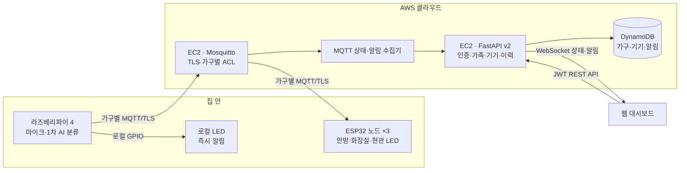

# Hearo — 청각장애인을 위한 가정용 환경음 인식 IoT 알림 시스템

> 도어락 소리, 노크, 비상벨, 아기 울음소리처럼 청각장애인이 놓치기 쉬운 생활 속 소리를 AI가 실시간으로 인식하고, LED와 웹 대시보드로 알려주는 IoT 시스템입니다.

**한이음 드림업 2026**

---

## 📋 목차

- [프로젝트 소개](#-프로젝트-소개)
- [핵심 기능](#-핵심-기능)
- [시스템 아키텍처](#-시스템-아키텍처)
- [기술 스택](#-기술-스택)
- [저장소 구조](#-저장소-구조)
- [진행 현황](#-진행-현황)
- [팀 구성](#-팀-구성)
- [관련 자료](#-관련-자료)

---

## 🎯 프로젝트 소개

국내 청각장애인은 약 40만 명으로, 화재경보 등 생활 속 소리 정보를 놓쳐 안전과 일상에 어려움을 겪습니다. Hearo는 가정 내 소리를 AI로 실시간 분류하여, **소리를 들을 수 없어도 무슨 일이 일어났는지 즉시 알 수 있도록** 돕는 IoT 알림 시스템입니다.

단순 소리 감지를 넘어, **집 안 어디에 있어도(같은 네트워크가 아니어도) 알림을 받을 수 있는 구조**를 목표로 개발하고 있습니다.

---

## ✨ 핵심 기능

- **환경음 실시간 분류**: 예 : 노크소리 · 도어락소리 · 비상벨소리 · 아기울음소리
- **즉시 로컬 알림**: 인터넷 연결 여부와 무관하게, 소리 감지 즉시 LED로 알림 (안전 우선 설계)
- **다중 공간 알림**: ESP32 원격 노드를 통해 여러 방에서 동시에 알림 — **서로 다른 네트워크에 있어도 동작**
- **알림 이력 조회**: 한국시간 기준 최근 7일의 감지 소리·위치·시각 조회 API 구현 *(실배포·프론트 연동 진행 필요)*
- **가족 공유와 기기 관리**: owner/member 가구 공유, 4개 기기 상태 조회 및 MQTT 연결 ON/OFF
- **클라우드 기반 인프라**: AWS 기반으로 구축되어 원격 접근 및 확장 가능

---

## 🏗 시스템 아키텍처



**설계 원칙**: 라즈베리파이가 소리를 1차로 판단해 **즉시 로컬 LED를 켜므로, 인터넷이 끊겨도 핵심 알림 기능은 항상 동작**합니다. 클라우드는 원격 노드 중계와 이력 저장을 담당합니다.

### AI 소리 분류 파이프라인

현재 구현된 기본 모델은 라즈베리파이의 INMP441 마이크로 1초간 소리를 수집한 뒤, 48 kHz 입력을 YAMNet 규격인 16 kHz mono로 변환합니다. YAMNet이 소리의 클래스 점수와 1,024차원 임베딩을 추출하면, Hearo 전용 TensorFlow Lite 분류기가 다음 9개 세부 클래스를 판별합니다.

| 사용자 알림 | AI 세부 클래스 |
|---|---|
| 노크소리 | 노크_목재, 노크_철재문 |
| 도어락소리 | 도어락_개방음, 도어락_입력음 |
| 비상벨소리 | 사이렌_삐뽀삐뽀, 사이렌_안내음, 사이렌_애애애애앵, 사이렌_철철철 |
| 아기울음소리 | 아기 울음 |

분류 결과가 임계값을 통과하면 라즈베리파이의 로컬 LED를 먼저 작동시키고, `hearo/{household_id}/alerts` MQTT 토픽으로 원격 LED 알림과 DynamoDB 저장 데이터를 전송합니다. 같은 소리가 반복 감지될 때는 5초 cooldown을 적용합니다. 마이그레이션 기간에는 기존 `hearo/alert`와 `hearo/log`도 함께 발행할 수 있습니다.

추가로 v2 고도화 코드를 구현했습니다. v2는 최근 2초의 YAMNet 프레임 임베딩을 종합하고, 9개 표적음 외에 `비표적음` 클래스를 추가하여 TV·대화·생활 잡음 등에 대한 오알림을 줄이는 구조입니다. 학습 단계에서는 `group_id` 기반 교차검증, 최대 3라운드 후보 비교, 확률 보정, 클래스별 임계값 선택 및 Keras–TFLite 일치 검증을 자동 수행합니다.

> **현재 상태:** v2 학습·평가·배포 코드는 구현되었으나, 실제 데이터로 전체 학습을 실행한 최종 정확도와 운영 배포 여부는 아직 확정되지 않았습니다. 따라서 성능 수치는 실행 결과 확인 후 추가할 예정입니다.

---

## 🛠 기술 스택

| 영역 | 기술 |
|---|---|
| **하드웨어** | Raspberry Pi 4, ESP32 (LOLIN D32), INMP441 (I2S 마이크), LED, SZH-RPI01 UPS |
| **AI / 소리 분류** | TensorFlow Lite, YAMNet (전이학습), 자체 학습 분류기 (2단계 파이프라인) |
| **클라우드 인프라** | AWS EC2, DynamoDB, Mosquitto (MQTT), FastAPI |
| **백엔드 언어** | Python (boto3, paho-mqtt) |
| **프론트엔드** | React, Vite, Emotion, React Router *(상세 스택·배포 현황은 아래 참고)* |

### AI 모델 세부 스택

- **특징 추출기:** TensorFlow Hub `google/yamnet/1` 및 배포용 YAMNet TFLite
- **전용 분류기:** TensorFlow/Keras 기반 전이학습 분류기, TensorFlow Lite 변환
- **오디오 전처리:** NumPy, SoundFile, resampy, pydub, SciPy
- **학습·평가:** scikit-learn grouped split, macro-F1, confusion matrix, 클래스별 precision·recall·F1, 비표적음 오알림률
- **라즈베리파이 추론:** `ai-edge-litert`, `tflite-runtime` 또는 TensorFlow Lite Interpreter, sounddevice
- **v2 모델 선택 기준:** development grouped CV macro-F1이 이전 모델보다 0.5%p 이상 개선되고 비표적음 오알림률 5% 이하를 만족할 때만 새 후보 채택

> 🔲 **프론트엔드 진행 상황 (기능 구현 범위, 배포 상태)** — 작성 예정

---

## 📁 저장소 구조

```
Project/
├── hearo_backend/             # FastAPI v2 인증·가족·기기·알림 API
├── firmware/esp32_hearo_v2/  # ESP32 3대 공통 펌웨어
├── infra/                     # AWS·Mosquitto·Nginx·systemd 배포 설정
├── scripts/                   # v1 알림 데이터 이전 도구
├── tests/                     # 백엔드 계약 자동 테스트
├── appAWS_v2.py              # Raspberry Pi AI 추론·로컬 LED
├── hearo_device_runtime.py   # 기기 polling·heartbeat·MQTT 제어
└── yamnet_fine_tuning_v2.ipynb
```


---

## 📊 진행 현황

| 영역 | 상태 |
|---|---|
| 하드웨어 (라즈베리파이 + ESP32 노드) | ✅ 완료 — 3노드 동시 통신 검증 완료 |
| ESP32 마이크 확장 | 🔲 예정 |
| 기존 AWS 인프라 (EC2, MQTT, DynamoDB) | ✅ 완료 |
| 가구 분리·MQTT TLS/ACL v2 인프라 | 🟡 코드·설정 구현 완료 — AWS 적용 필요 |
| 다중 네트워크 알림 (핵심 목표) | ✅ 검증 완료 |
| 기존 웹 대시보드 API | ✅ 완료 |
| 가족·기기·최근 7일 FastAPI v2 | 🟡 코드·자동 테스트 완료 — 배포·프론트 연동 필요 |
| 웹 대시보드 연동 (프론트엔드) | 🔄 진행 중 |
| AI 기본 모델 학습·추론 파이프라인 | ✅ 코드 구현 완료 — YAMNet + 9개 세부 클래스 분류 및 4개 사용자 알림 매핑 |
| AI 모델 v2 고도화 | 🟡 코드 구현 완료 — 실제 데이터 학습·성능 검증·라즈베리파이 배포 필요 |
| AI 모델 고도화 (클라우드 하이브리드 추론) | 🔲 예정 |


### AI 모델 파트 상세 진행 현황

- `yamnet_fine_tuning.ipynb`: 원본 파일 단위 train/validation 분할, train-only 데이터 증강 및 YAMNet 임베딩 기반 9개 클래스 분류 구현
- `appAWS.py`: 1초 마이크 입력, YAMNet 1차 필터, Hearo 전용 TFLite 분류, 로컬 LED·MQTT 알림 및 cooldown 구현
- `yamnet_fine_tuning_v2.ipynb`: `metadata.csv` 검증, 비표적음 포함 10개 클래스, 그룹 기반 CV, 최대 3라운드 자동 모델 비교, calibration·threshold 선택 및 TFLite 내보내기 구현
- `appAWS_v2.py`: 1초 단위 녹음과 최근 2초 rolling buffer, 프레임 집계, 비표적음 거부, 모델 메타데이터 기반 클래스별 임계값 적용 구현
- `hearo_backend/`: JWT 인증, 가족 공유, 4개 기기 상태·제어, 최근 7일 AlertHistoryPage, 연락처, WebSocket 구현
- `hearo_device_runtime.py`: Raspberry Pi의 TLS MQTT, command/ACK, 15초 설정 polling, heartbeat 구현
- `firmware/esp32_hearo_v2/`: ESP32 3대의 TLS MQTT 알림, ON/OFF, 설정 보존, HTTPS 재연결 구현
- **남은 작업:** 비표적음 데이터와 `metadata.csv` 준비 → Colab 전체 학습 → `metrics.json` 검토 → TFLite 모델 라즈베리파이 배포 → 실제 가정환경 통합 테스트

> 🔲 **프론트엔드 파트 상세 진행 현황** — 회의에서 확인 후 업데이트 예정

---

## 👥 팀 구성

| 이름 | 역할 |
|---|---|
| 장원석 | 팀장 · 하드웨어 · 클라우드 인프라 |
| 홍한희 | 프론트엔드 |
| 한나영 | 프론트엔드 |
| 정승민 | 데이터 · 문서 작업 |

---

## 📚 관련 자료

- [Hearo PRD](./Hearo_PRD.pdf)
- [기존 YAMNet 학습 노트북](./yamnet_fine_tuning.ipynb)
- [YAMNet v2 고도화 노트북](./yamnet_fine_tuning_v2.ipynb)
- [기존 Raspberry Pi 추론 코드](./appAWS.py)
- [Raspberry Pi v2 추론 코드](./appAWS_v2.py)
- [웹 대시보드 API](./dashboard_api_v1.py)
- [가족·기기·알림 백엔드 v2 적용 가이드](./README_BACKEND_V2.md)
- [FastAPI v2 진입점](./dashboard_api_v2.py)

---

<div align="center">

**Hearo** — 소리를 놓치지 않는 세상을 위해

</div>
